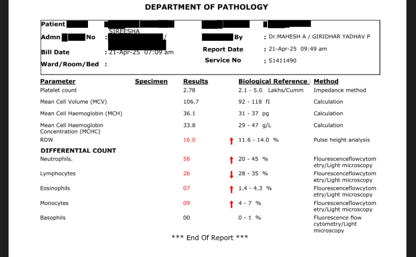

# Lab Report OCR Processor

A scalable OCR-based solution for extracting structured data from medical lab reports.

## Project Overview

This project provides an API for extracting and processing lab test data from medical reports using OCR technology. It can identify test names, values, reference ranges, and determine whether results are outside normal ranges.

## Sample Reports and Results

### Sample Lab Report

*Example of a standard blood test report from Department of Pathology*

The system can process various lab report formats and extract structured data including test names, values, and reference ranges.

### API Processing Results


*Terminal output showing successful API requests and structured JSON response*

As shown in the terminal output, the system successfully processes lab reports and returns structured data with test parameters, values, reference ranges, and flags for out-of-range values.

## Features

- Extract text from lab report images using OCR
- Identify lab test names, values, and reference ranges
- Determine if results are outside normal ranges
- Process reports via REST API or command line
- Deploy as serverless application on Vercel

## Installation

```bash
# Clone the repository
git clone <repository-url>

# Install dependencies
pip install -r requirements.txt
```

## Usage

### Command Line

```bash
# Process a single image
python main.py --image path/to/image.jpg

# Start the API server
python main.py --server
```

### API Endpoints

- `POST /get-lab-tests` - Upload an image file for processing

## Deployment

This application is configured for deployment on Vercel:

1. Set up the project with required files (vercel.json, requirements.txt)
2. Deploy using the Vercel CLI or connect to GitHub repository
3. Access the API through the provided Vercel URL

## Technology Stack

- Python with FastAPI
- OCR for text extraction
- NLP for medical term recognition
- Serverless deployment on Vercel